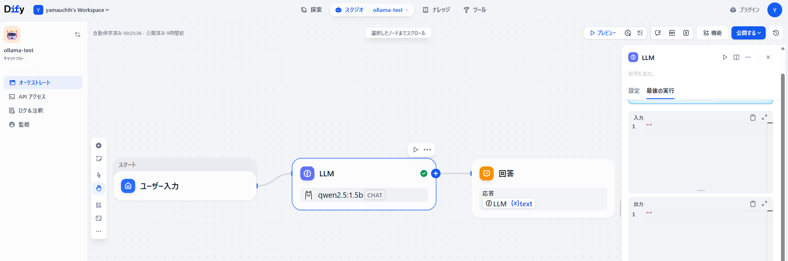

※インターネット接続可能な環境で実施

# OSインストール
````PS
wsl --install AlmaLinux-10
````

# Ollama/gpt-ossインストール(ローカルLLM)
````Bash
curl -fsSL https://ollama.com/install.sh | sh
ollama run gpt-oss
````
→メモリ不足で起動失敗/断念

# qwenインストール(比較的軽い別のモデル)
````Bash
ollama run qwen2.5:1.5b
````

# 生成AIしてみる(ollama CLI)
````Ollama
>>>> こんにちは、自己紹介して
こんにちは！私は人工知能アシスタントで、あなたが質問や要望をすることを選んでいます。私の目指す目標は、あなたの生活の
一部となり、より便利な世界を作り出そうと考えています。

何か具体的なことを教えていただければ、私について詳しくお話しできます。例えば、「何について学びたいですか？」とおっし
ゃってください。

>>> 乃木坂46はわかりますか？
はい、理解していますね。乃木坂46は日本のアイドルグループで、2008年に結成されたアイドルグループの一つです。メンバーは
全員大学生や高校生として活躍しており、歌を歌うだけでなく、ダンス、演技など様々な能力を持っています。

彼女たちの特徴としては、元気な雰囲気と可愛らしさが人気を集めています。彼らの活動は年間を通して行われており、音楽コン
サートやイベント、ファン向けのプロジェクトなどがされています。

また、乃木坂46にはグループとしてだけでなく、個々のメンバーも存在しますので、それぞれに異なるポジションを持っています
ね。

>>> 乃木坂46のエースは誰ですか？
乃木坂46のエースとは、このアイドルグループの中で最も人気や知名度が高いメンバーを指します。2019年現在、エースとして挙
げられるのは「佐藤帆莉奈」さんです。

佐藤帆莉奈さんは、「1位」として多くの人々から愛される地位にあります。彼女の魅力は幅広く、歌、ダンス、演技など多岐に
わたる才能を持っています。彼女がエースだとされる理由は、その存在感と人気の高さからです。

また、グループの中でも特に人気があるメンバーたちの中で、「乃木坂46のエース」という表現は一般的にはこのメンバーを指し
ます。ただし、グループ全体のファンからは「皆がエース」とも呼ばれることもありますね。
````

→大ウソつきだが一旦気にしない

# 生成AIしてみる(API経由)
````Bash
 curl http://localhost:11434/api/chat \
  -d '{
    "model": "qwen2.5:1.5b",
    "messages": [
      {
        "role": "system",
        "content": "事実が不明な場合は推測せず「分からない」と答えてください。"
      },
      {
        "role": "user",
        "content": "Ollamaは何ですか？"
      }
    ],
    "stream": false
  }'

{"model":"qwen2.5:1.5b","created_at":"2026-01-29T14:04:29.001303912Z","message":{"role":"assistant","content":"Ollamaは、2021年8月に開発された、GoogleのAI（人工知能）研究チームによって作られました。これは非常に複雑なアセンブリコードと高度な計算能力を持つニューラルネットワークを構成する大規模なソフトウェアプログラムです。\n\nOllamaは主に、次のような目的で使われます：\n\n1. 人工知能の開発研究\n2. データ処理や機械翻訳など、自然言語理解と生成に関するアプリケーション\n3. 特定のタスクに対する最適化アルゴリズムの開発\n4. 大規模な計算に耐えられるクラウド実行環境\n\nこのソフトウェアは非常に複雑で、Ollama自体が一部のコンピュータ科学的知識と高度な数学を駆使しながら動作します。そのため、プログラムは非常に長い手順と計算時間が必要となり、Ollamaはその結果として大規模で高機能であるという特徴を持っています。\n\nしかし、この複雑さからも読み取れるように、Ollamaの性能には限界があり、特定のタスクやパフォーマンスに対する期待値を超えることは難しく、またそれらは常に進化し続ける技術です。"},"done":true,"done_reason":"stop","total_duration":8402957738,"load_duration":70384614,"prompt_eval_count":35,"prompt_eval_duration":300993413,"eval_count":294,"eval_duration":7777280920}
````

# Difyいれてみる(DockerをLinuxネイティブ)　・・・失敗
````Bash
sudo dnf install git
sudo dnf install podman-docker
sudo dnf install python3-pip
pip3 install --user podman-compose

cd
git clone https://github.com/langgenius/dify.git
cd dify/docker
docker compose up -d
````
→WSLの都合で起動せず

# Difyいれてみる(ホストのDocker Desktopを利用)　・・・成功
````Bash
sudo dnf remove -y podman podman-docker podman-compose
pip3 uninstall podman-compose
````
ホスト上のDocker Desktopと組み合わせて、なんとかDifyまで動いた！詳細はメモってない。
Docker Desktop側でWSLイメージ指定してcomposeを使えるようにして、普通のDifyを動かすかんじ。
多分こんな感じ(history抜粋)。
````Bash
cd ~/
sudo dnf install git
git clone https://github.com/langgenius/dify.gi
cd dify/docker
cp .env.example .env
docker compose up -d
````

# オフラインインストール
https://docs.ollama.com/linux#install-cuda-drivers-optional

# 出来上がり画面



